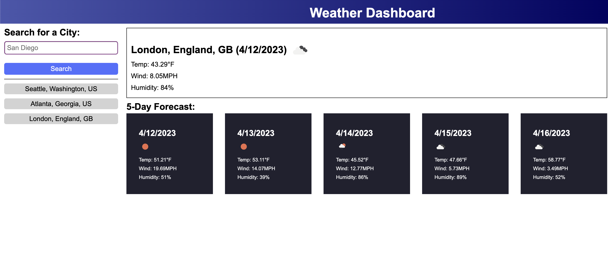

# Module 06 - Server-Side APIs: Weather Dashboard#

## Description

A weather dashboard which uses openweathermap.org APIs to pull current and 5-day forecast weather data. 

## Installation

N/A

## Usage

Access the website at https://aerostokes.github.io/06-Weather-Dashboard/ 

Enter a city and click search to see the current weather conditions and the 5-day forecast for that city. Searches are automatically saved on the left side for easy repeat searching. 

## Credits

N/A

## License

See repo.
